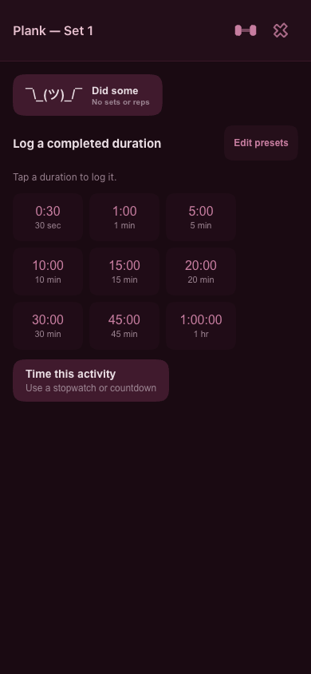
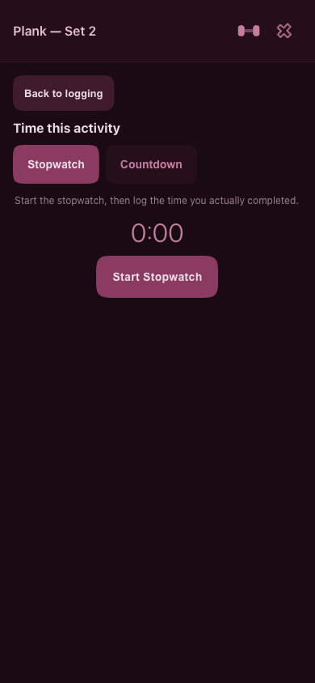
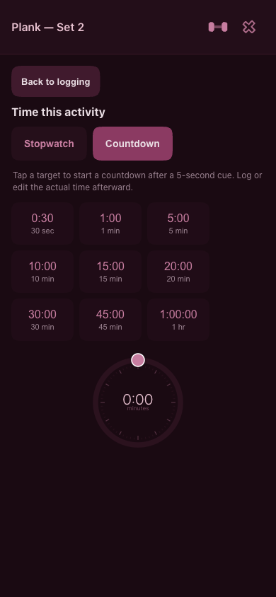

# Quick logging and separate timing screen — 2026-10-07

Tim approved keeping presets as immediate completed-duration logging and moving stopwatch/countdown into **Time this activity**. Pairing remains one shared duration recorded against two timed activities.

Tim then requested an aesthetic refinement: compact buttons and weight controls hidden behind the same SVG used in the other set pickers.

Implemented in `../../index.html`, locally only. Uncommitted and not deployed.

## Behavior

- The initial screen says **Log a completed duration**. Tapping a preset logs immediately.
- **Time this activity** opens a separate screen with Stopwatch and Countdown. **Back to logging** returns while the timer is idle; a stopwatch can be reset and a countdown canceled before returning.
- Countdown presets and the dial only start timing, after the existing five-second cue. Completion does not save automatically.
- Both tools retain actual-time correction. Pairing records the chosen or corrected duration in each activity's own history.
- Editable presets, optional distance and units, and the single-activity **Did some** action remain available.
- Did some, Time this activity, tool choices, and timer actions fit their contents. Duration presets use a three-column grid capped at 280px; action rows wrap on narrow screens.
- The load toolbar and header weight text are removed. A bare dumbbell SVG with a 44px target opens the existing load sheet for Bodyweight, No load, and Add weight. Shared-duration pairs omit it. Add weight is disabled while a timer has started, preventing navigation from discarding that timer; Bodyweight/No load can change directly.
- Palette and squircle geometry are retained. The new screen transition is 200ms, `cubic-bezier(0.25, 0.1, 0.25, 1)`; reduced motion disables it. Timer content controls have a 44px minimum height.

## Verification

Used the complete app in fresh, isolated Chromium browser contexts against a loopback preview. Seeded synthetic activities only in those contexts; service workers were blocked so each run read the current source. The main flow script is [verify.cjs](./verify.cjs), with [captured results](./results.json), rerun after the aesthetic refinement. The focused layout/load check is [verify-aesthetic.cjs](./verify-aesthetic.cjs), with [results](./aesthetic/results.json). Both scripts support `PLAYWRIGHT_MODULE`, `CHROMIUM_PATH`, `PREVIEW_URL`, and `EVIDENCE_DIR` overrides; otherwise they use an installed Playwright browser and `http://127.0.0.1:8769`.

Passed:

- Opening timing and selecting a tool creates no saved sets. Returning from Countdown does not change quick-log preset behavior.
- A quick duration preserves optional distance and the selected unit.
- Added a 1:25 preset, logged exactly 85 seconds, and retained the preset after reload.
- Stopwatch start, pause, resume, time-edit cancellation, applying 45 seconds, and explicit logging.
- A running 30-second countdown resumes after canceling its editor, then logs an edited 18-second actual duration.
- A completed two-second countdown saves nothing until requested; both direct logging and editing to a longer duration work.
- Canceling the countdown's start cue writes nothing and permits returning to quick logging.
- Pairing creates two 15-minute entries with reciprocal links. Canceling a pair does not link a later single-activity log.
- A paired countdown logs an edited four-second duration to both histories.
- **Did some** writes a presence marker with no invented duration.
- All 14 test entries and the edited presets survive reload; no page errors occurred.
- Both screens fit at 320px and 390px; the tested screen buttons meet 44px targets. Both remain centered at 430px in a 1000px viewport.
- Reduced-motion mode removes the new screen animation.
- A supplementary browser check confirmed stopwatch reset, return to quick logging, and zero sets written by that navigation.
- The updated quick-log screen has no stretched buttons at 320/390/1000px. The weight SVG has a transparent background, no border, no shadow, no extra SVG plate, and no visible weight label.
- The load sheet closes with Escape and restores focus. Bodyweight/No load update correctly; Add weight selects and logs 45 lbs with a 30-second duration. Add weight is disabled while the stopwatch is active.
- Idle and paused stopwatch controls, countdown presets and completed actions, and actual-time editors fit at 320px with 44px targets. Editing a completed countdown to four seconds still saves correctly. Paired entry omits the load trigger.

The initial local source had parse errors in the timer and date-sheet edits. The timer rendering change resolves its mismatched closure; the date sheet now restores its missing `dayLabel` conditional/fragment around the activity view. All seven inline scripts pass `node --check`. A supplementary browser check opened the date sheet both without a split and after assigning Core. The stopwatch editor also appeared twice in the DOM; it now renders once.

Physical iPhone behavior and production deployment are not verified by these checks.

## Previews

These show the refined controls with the app's default nine duration presets and a synthetic Plank activity.

| Quick log | Stopwatch | Countdown |
|---|---|---|
|  |  |  |

[Quick log at 320px](./quick-log-preview-320.png) · [Countdown at 320px](./countdown-preview-320.png)

[Load sheet at 320px](./aesthetic/load-sheet-320.png) · [Paused stopwatch at 320px](./aesthetic/stopwatch-paused-320.png) · [Actual-time editor at 320px](./aesthetic/actual-time-320.png) · [Completed countdown at 320px](./aesthetic/countdown-complete-320.png)
