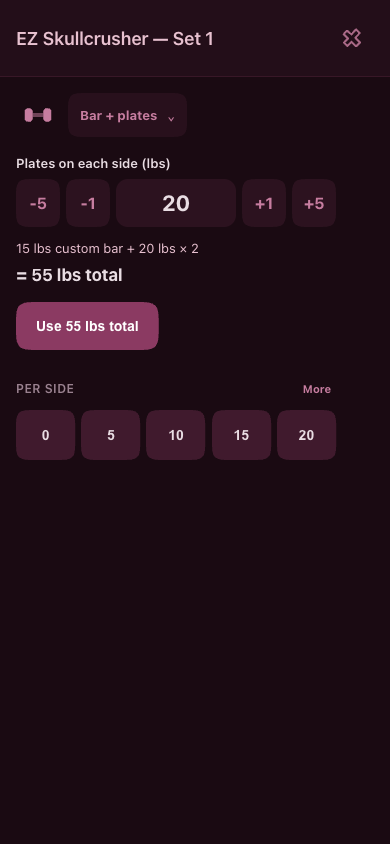
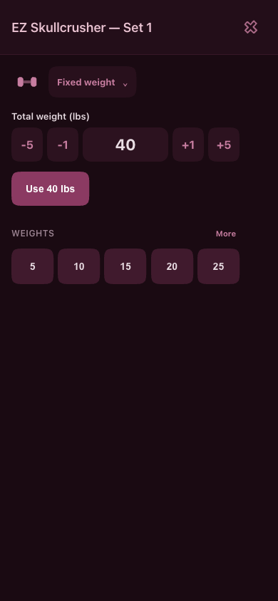

# Per-set equipment and compact weight entry — 2026-10-07

Tim requested easy switching between fixed-weight equipment and a bar with removable plates within the same activity, clear arithmetic, and a compact selector beside the weight SVG. Implemented locally in `../../index.html`. Uncommitted and not deployed.

## Behavior

- The drawn equipment menu sits beside the bare load SVG, with **Fixed weight**, **Bar + plates**, and **Per hand** choices. It replaces the full-row Bar math accordion and avoids navigating into activity editing.
- Fixed weight enters the complete load. Bar + plates enters weight on each side; the calculation stays visible: **15 lbs custom bar + 20 lbs × 2 = 55 lbs total**.
- Standard bar, EZ bar, and custom bar weights are available in the same menu. A nonpositive custom bar cannot be logged. Changing the bar preserves the selected plates per side.
- Fixed, per-hand, and plate values remain separate while switching within a picker. Reopening uses the latest logged equipment and retains recent values for the other modes.
- The Use action fits its text. Presets use a bounded grid with a More expansion; numeric steppers remain at least 44px wide. The phone frame remains at most 430px on desktop.
- Each set saves its chosen `weightMeaning`, total `weight`, and optional `barWeightAtLog`/`barNameAtLog`. The activity's default does not overwrite those choices. Repeat shortcuts preserve the original equipment.
- Bar history labels show the recorded full total; per-hand entries say “each.” Legacy bar records without a snapshot remain totals. No stored history is rewritten or inferred from a current bar setting.
- Existing Load and Grip sheets remain. Menu keyboard support includes arrow navigation, Home/End, initial-letter navigation, Enter/Space, and Escape with focus return. Outside click dismisses it. New transitions use 200ms and respect reduced motion.

## Verification

Used isolated fresh Chromium contexts, synthetic records, and a loopback preview with service workers blocked. No real workout data or live deployment was changed.

The [equipment flow script](./verify.cjs) and [results](./results.json) cover:

- A 15 lb custom bar with 20 lb on each side logs 55 lb total, with its 15 lb snapshot.
- Switching to fixed 40 lb and back preserves the plate draft. The same activity also logs a fixed 50 lb set without a bar snapshot.
- The next picker restores the latest mode. Arrow/Enter switching, Escape focus return, and outside-click dismissal work.
- Per-side presets log their full calculated total. Custom bar changes from 15 to 25 lb preserve plates and leave earlier snapshots untouched; zero bars disable logging.
- A standard 45 lb bar with 45 lb per side logs 135 lb. Per-hand dumbbell entry and a timed weighted entry save their selected meanings correctly.
- Stored legacy history and the activity default remain unchanged. Mixed equipment and custom bars survive reload; no page errors occur.
- 320/390/1000px layouts keep the menu trigger beside the SVG, compact actions, 44px targets, and no horizontal overflow. Reduced motion removes the entrance animation.

The [repeat/backup script](./verify-copy-backup.cjs) and [results](./copy-backup-results.json) cover:

- Same weight and Both preserve a recorded 25 lb bar and 65 lb total even when the activity default is a 15 lb bar.
- Same reps switches to a fixed 40 lb bar, saves the existing 12 reps, and Both repeats it without attaching a bar snapshot.
- Actual CSV export and import into another fresh browser context preserve all five test sets, their meanings, totals, snapshots, and reps.
- Adjacent same-total sets with different equipment still show a load label instead of hiding the change.

The existing [timer-flow checks](../timer-flow-2026-10-07/verify.cjs) and [compact timer/load checks](../timer-flow-2026-10-07/verify-aesthetic.cjs) were rerun after the shared load changes; both pass. [Timer results](./timer-results.json) · [Timer/load results](./timer-load-results.json). All seven inline scripts pass syntax checks, and the diff passes whitespace checks.

Physical iPhone use remains unverified. These previews are local candidates for Tim's review.

## Previews

| Bar + plates | Fixed weight |
|---|---|
|  |  |

[Equipment menu](./equipment-menu-390.png) · [320px layout](./bar-plates-320.png) · [Mixed equipment in the daily log](./mixed-history-390.png)

Both scripts accept `PLAYWRIGHT_MODULE`, `CHROMIUM_PATH`, `PREVIEW_URL`, and `EVIDENCE_DIR`. The preview URL defaults to `http://127.0.0.1:8771`.
